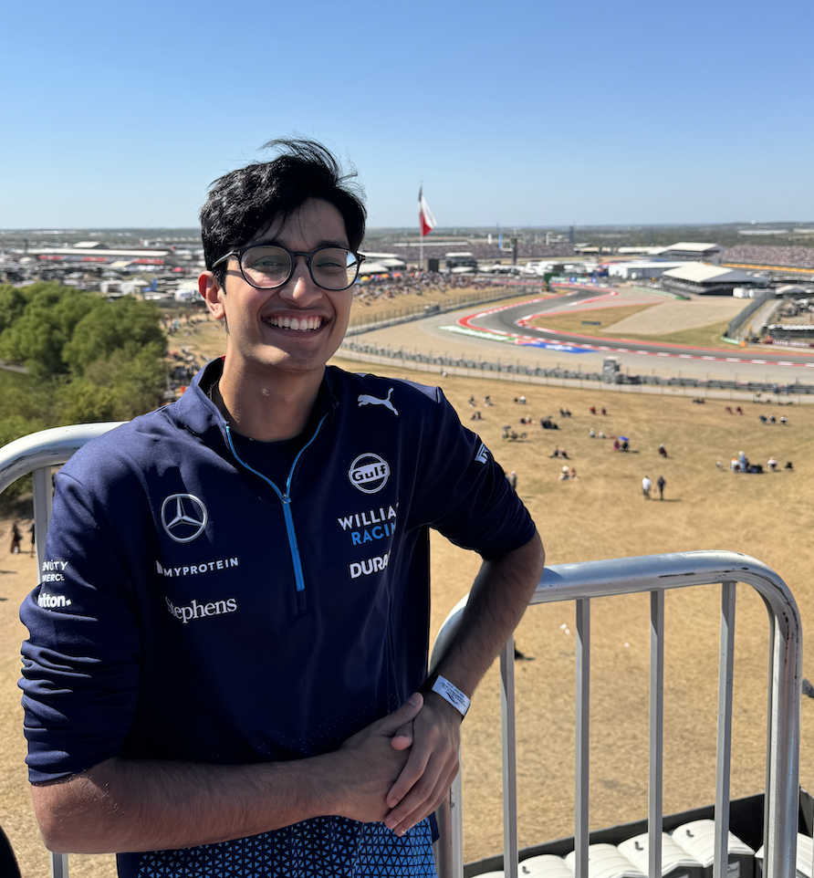

## about me:
hi, my name is armaan bassi! I’m a sophomore studying computer science and electrical engineering at UCLA. I'm interested in software engineering, quantitative finance, robotics, and artificial intellegence. 

I was born and raised in north New Jersey. In my free time, I enjoy listening to music 🎶🎶, lifting weights 🏋️‍♂️🏋️‍♂️, rock climbing (not beating the CS major stereotypes) 🧗🧗, playing video games 🎮🎮, and formula 1 (i'm a diehard mclaren fan) 🏎️🏎️

    
    
This is me at the 2024 Austin Grand Prix! (ignore the Williams merch)

## education 🎓:
### University of California - Los Angeles (UCLA) 🐻 *Expected Graduation 2026*
B.S. in Computer Science (GPA: 3.9/4.0) Los Angeles, CA

LA Hacks (Hacker Operations Coordinator), Bruin Sports Analytics (Tennis Consultant), Creative Labs (Developer), Daily Bruin (Developer), Rock Climbing Club, Cubing Club, Intramural Flag Football

### Millburn High School *2019 - 2023*
High School Diploma (GPA: 4.22/4.0) Millburn, NJ

Millburn Robotics (Captain), Librehacks (Co-founder), MHS Esports (Vice President), HackMHS (Logistics Lead), New Jersey Youth Symphony Percussionist, AI Club, Varsity Boys Track and Field

---

## courses i've taken 📝:
* ### computer science:
    - 🛠️ computer organization in assembly (CS 33)
    - data structures and algorithims in C++ (CS 32)
    - object-oriented programming in C++ (CS 31)

* ### math:
    - 🛠️ differential equations (MATH 33B)
    - linear algebra (MATH 33A)
    - multivariable calculus (MATH 32A/B)

* ### statistics:
    - 🛠️ statistics and probability (STATS 100A)
    - statistical programming in R (STATS 20)

* ### science:
    - 🛠️ physics mechanics lab (PHYSICS 4AL)
    - physics mechanics (PHYSICS 1A)

* ### miscellaneous:
    - intro to latin american music (ETHNOMUS M108A)
    - intro to the art of filmmaking (FILM TV 4)

---

## Work Experience 💼:

### Quanergy Solutions Inc. *Jun 2024 – Aug 2024*
**Software Engineering Intern** *Remote*

- Enhanced debugging efficiency by redesigning the connection between a React frontend, Python backend, and MySQL database, improving data flow and system responsiveness.

### Bruin Sports Analytics *Jan 2024 – Present*
**Tennis Data Science Consultant** *Los Angeles, CA*

- Streamlined match reporting by automating summaries for D1 tennis teams, making data more accessible to coaches.

### LAHacks *Oct 2023 – Present*
**Hacker Operations Organizer** *Los Angeles, CA*

- Secured substantial sponsorships from leading tech companies, organizing panels and workshops that enriched the hackathon experience.

### Librehacks  *Apr 2020 – Aug 2023*
**Logistics Lead** *Millburn, NJ*

- Founded a certified non-profit robotics program to drive STEM engagement, expanding it to multiple schools and hosting an annual hackathon.